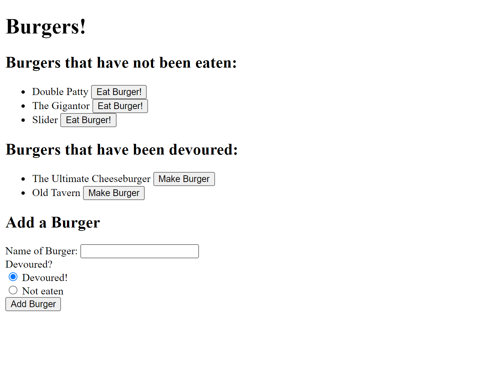

# Eat Da Burger

## Description:
Eat Da Burger is a full stack web application that allows users to create, view, and update different burgers. Once a burger is added, it will appear under the section 'Burgers that have not been eaten' if it has not been devoured and under the other section, 'Burgers that have been devoured', if the opposite is true. You are able to click on the button next to any burger to switch it into the other section. Enjoy!

## Images:

## Installation:
To install, first clone the repository, then open MySQL workbench. Find the schema.sql and copy all the text from into workbench to set up the database. Lastly, within the application terminal, run 'npm install' to download all necessary npm packages. 

## Usage:
You can find the deployed site here: https://eat-da-burger-bf.herokuapp.com/

## Questions:
Contact me with any questions!
- Github: [github.com/bethanyfulcher](https://github.com/bethanyfulcher)
- Email: fulcherbethany@gmail.com