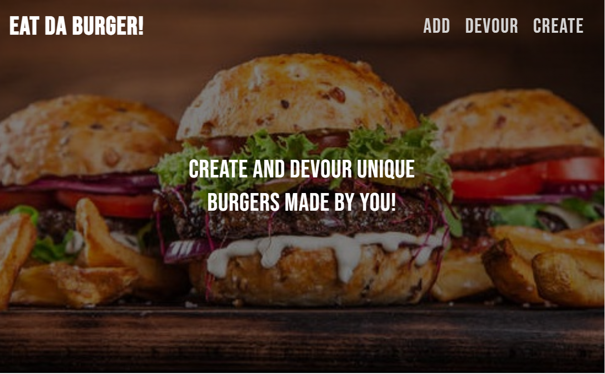
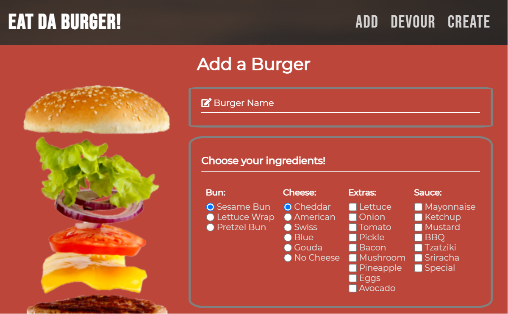
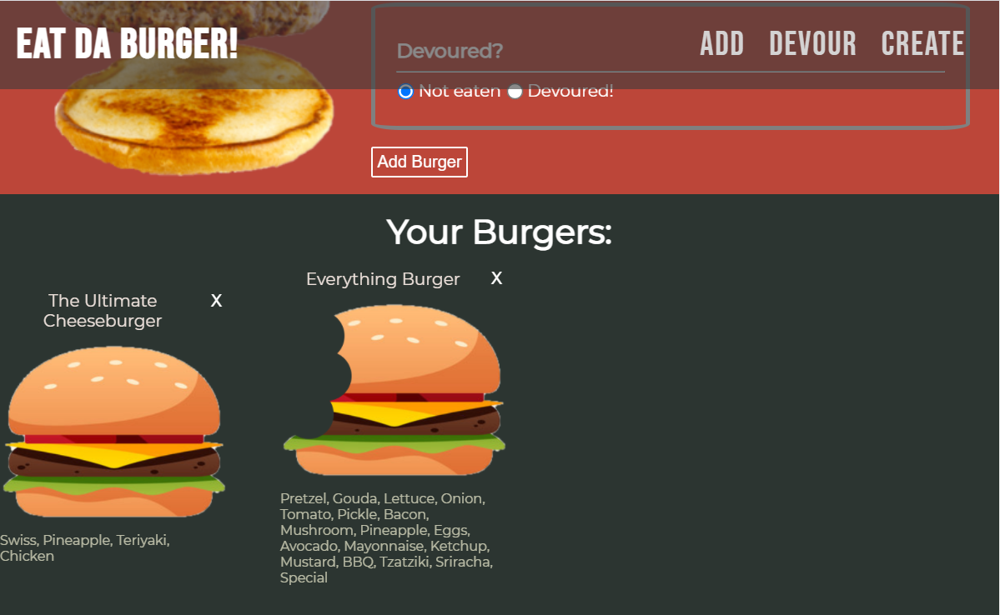
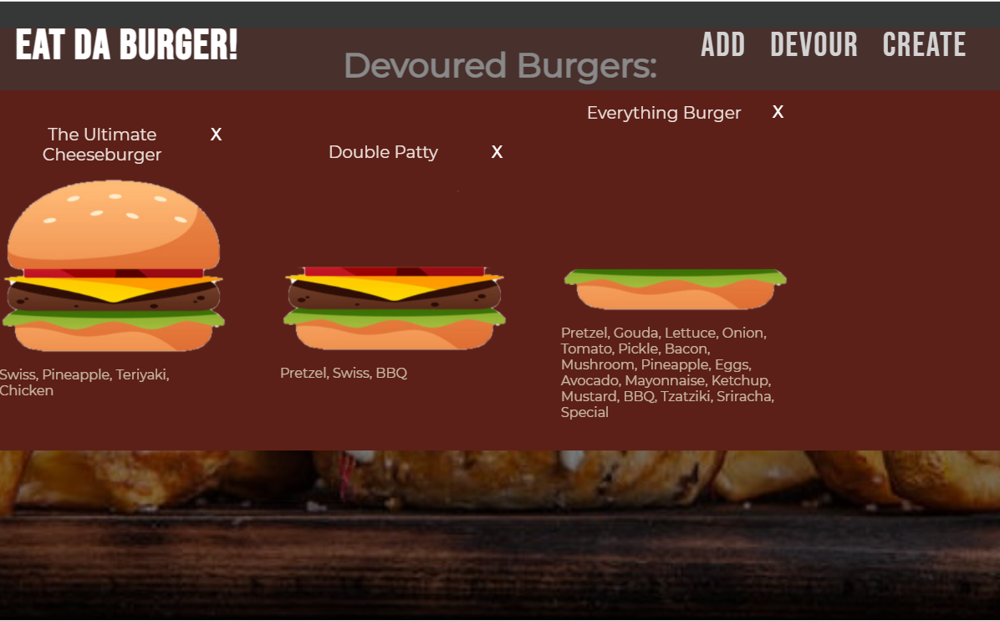

# Eat Da Burger

## Description:
Eat Da Burger is a full stack web application that allows users to create, update, and delete different burgers. Once a burger is added, it will appear under the section 'Your Burgers' if it has not been devoured and under the other section, 'Devoured Burgers', if the opposite is true. You are able to click on any burger to either eat or create and switch it into the other section. Enjoy!

You can find the deployed site here: https://eat-da-burger-bf.herokuapp.com/

## Images:

## Installation:
To install, first clone the repository, then open MySQL workbench. Find the schema.sql and copy all the text from into workbench to set up the database. Lastly, within the application terminal, run 'npm install' to download all necessary npm packages. 

## Questions:
Contact me with any questions!
- Github: [github.com/bethanyfulcher](https://github.com/bethanyfulcher)
- Email: fulcherbethany@gmail.com